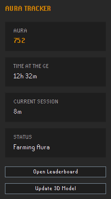
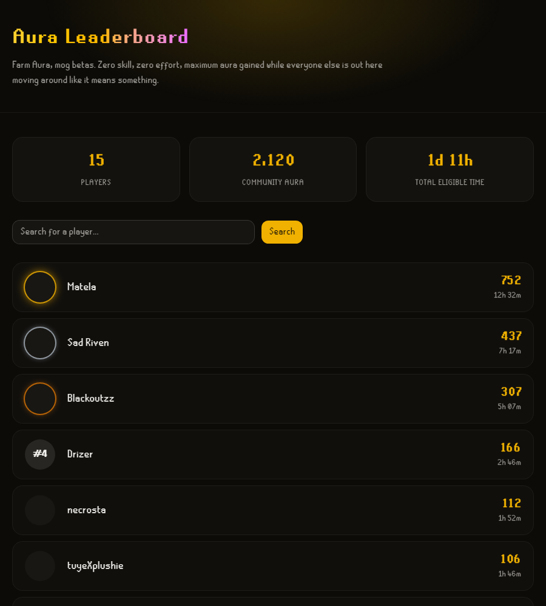
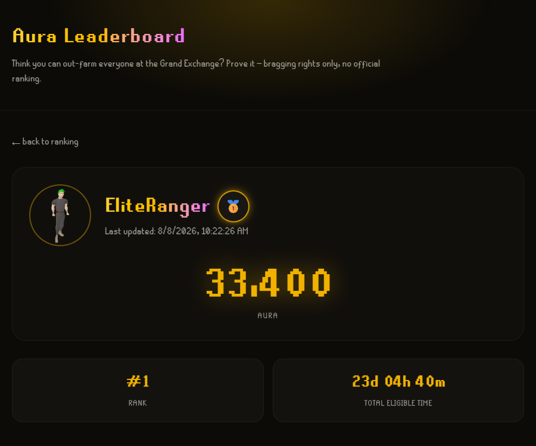

# Aura Leaderboard — Next.js + shadcn/ui

Companion website for the [Aura Tracker](../aura-farming-claude) RuneLite plugin, backed by [`aura-back`](../aura-back). Ranking **community, unofficial** — see the notice on every page and the anti-cheat section in [`aura-back/SECURITY.md`](../aura-back/SECURITY.md).

**Status:** implemented and connected end-to-end to the RuneLite plugin — validated with a real Jagex account. Deployed since 2026-08-08: [`aura-web-one-green.vercel.app`](https://aura-web-one-green.vercel.app), backed by [`aura-back-eta.vercel.app`](https://aura-back-eta.vercel.app) and Neon Postgres.

## Screenshots

<table>
<tr>
<td></td>
<td></td>
<td></td>
</tr>
<tr>
<td align="center">Sidebar panel</td>
<td align="center">Leaderboard</td>
<td align="center">Player page</td>
</tr>
</table>

The sidebar panel is from the [Aura Tracker](../aura-farming-claude) plugin itself. Leaderboard/player screenshots show synthetic demo data (`aura-back/scripts/seed.ts`), not a real player's account.

## Stack

Next.js 16 (App Router) + TypeScript + shadcn/ui + Tailwind. **No database of its own** — every read goes over HTTP to `aura-back` (`fetch`, server-side, in Server Components). See [SECURITY.md](SECURITY.md) for the threat model, including why that split is a real trust boundary.

## Font

`src/fonts/runescape*.ttf` is the real OSRS font, extracted from the game itself — the
same files RuneLite bundles in
`runelite-client/src/main/resources/net/runelite/client/ui/`. Sourced from
[github.com/RuneStar/fonts](https://github.com/RuneStar/fonts), which declares CC0, but
that declaration only covers the extractor's own rights, not necessarily Jagex's
copyright over the font design itself — not a 100% clean license. It's the same font
used across the entire OSRS fan-tool ecosystem (including RuneLite itself, a
Jagex-approved client) with no history of action against this specific use.
**A conscious decision by the project owner**, not a silent assumption — if this choice
ever needs revisiting, just swap `src/fonts/` for another font and adjust
`--font-heading` in `globals.css`.

## Setup

```bash
npm install
cp .env.development.example .env.development   # NEXT_PUBLIC_BACKEND_URL, points at aura-back
cp .env.production.example .env.production
```

## Running locally

```bash
npm run dev
```

Opens on `http://localhost:3002` (deliberately different from `aura-back`'s `3000`, so both can run side by side locally). Needs `aura-back` running too (or pointed at a deployed instance via `NEXT_PUBLIC_BACKEND_URL`) — this app has nothing to show on its own.

## Structure

```
src/
  proxy.ts                       # nonce CSP + security headers (Next.js 16's "proxy", replaces middleware.ts)
  app/
    page.tsx                     # leaderboard + search
    player/[displayName]/page.tsx
  lib/
    config.ts                    # NEXT_PUBLIC_BACKEND_URL, BEHIND_TLS_PROXY
    api-client.ts                # every fetch to aura-back lives here
    utils.ts
  components/
    rank-badge.tsx                # rank badge — 3D model if it exists, else medal/number
    rank-badge-model.tsx          # lazy-loaded model thumbnail, used inside RankBadge
    player-model-viewer.tsx       # interactive 3D viewer on the player page
    stat-tile.tsx
    ui/                           # shadcn/ui
  types/
    model-viewer.d.ts             # JSX augmentation for the <model-viewer> custom element
```

## License

BSD 2-Clause — see [LICENSE](LICENSE).
